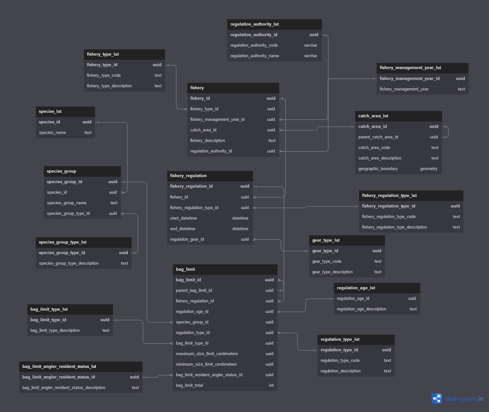
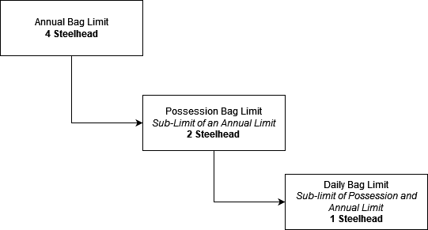
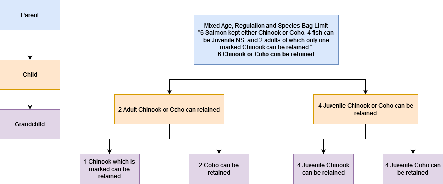

This is a short demonstration of output of regulation data from a proposed 
regulation database for ADFG data. 


# Schema



# Connecting to the database

## Driver

The Windows Postgres driver needs to be installed on the local machine to access this database. The driver can be found [here]( https://www.postgresql.org/ftp/odbc/versions/msi/) 

## Connecting to the database
```{r connect_db}
library(DBI)
# the postgres driver needs to be installed
# connect to database
con <-  DBI::dbConnect( 
               odbc::odbc(),
               driver = "PostgreSQL Unicode",
               database = "postgres",
               server = "34.217.107.216", 
               port = "5433", 
               uid = "ro",
               pwd = "salmon"
               )


```

PostgreSQL's time zone is UTC. Set the locale to the proper timezone for the database session.

```{sql, connection=con}
SET timezone = 'America/Anchorage'
```

# Hierarchical Relationships

## Catch Areas
Catch areas, and defined purely spatially have many configurations and have the ability
to change over time. Sometimes regulatory authorities subdivide and/or have intersecting 
'sub' catch areas to gain a finer control of a fishery in a spatial context. These 
subdivide catch areas often have separate regulations, but still need 
to have the context of the greater catch area. Databases, being tabular in a nature will normally 
have a catch area per row, with relationships expressed as joins to other tables. This architecture is limiting 
because each catch area would need a copied or aliased table to join to.

A hierarchical data structure is a solution to this problem. Having a catch table
join *to itself* allows for unlimited recursion and will maintain the referential integrity - 
so children catch areas are always tied to their parents.


## Bag Limits
Bag limits are similar to catch areas and can be represented in a similar hierarchical 
data structure. Take a simple example: annual, possession, and daily limits. A possession limit is part 
of an annual limit, and a daily limit is part of a possession limit. 




This database retains the referential integrity of each level of bag limit (parent, grand, child, ...). This allows 
for each individual bag limit to be represented atomically, while still connected to related bag limits. 
Ultimately this will allow to query for a single bag limit, but the returning data will have all 
associated bag limits to give the single bag limit context.

JSON Representation of hierarchical bag limits - Steelhead

An example of representing this hierarchy with JavaScript Object Notation 
(JSON). Note that the indented child_bag_limits fields holds the same data model as its 
parent and the *bag_limit_type_description* field.

```{json}
[
  {
    "minimum_size_limit_centimeters": null,
    "parent_bag_limit_id": null,
    "bag_limit_total": 4,
    "maximum_size_limit_centimeters": 91.44,
    "resident_status": {
      "bag_limit_angler_resident_status_description": "Not applicable"
    },
    "regulation_type": {
      "regulation_type_code": "NS",
      "regulation_type_description": "Non-Selective Fishery"
    },
    "bag_limit_type": {
      "bag_limit_type_description": "Annual"
    },
    "species_group_type": {
      "species_group_type_description": "Steelhead"
    },
    "children_bag_limits": [
      {
        "minimum_size_limit_centimeters": null,
        "bag_limit_total": 2,
        "maximum_size_limit_centimeters": 91.44,
        "regulation_type": {
          "regulation_type_code": "NS"
        },
        "bag_limit_type": {
          "bag_limit_type_description": "Possession",
        },
        "species_group_type": {
          "species_group_type_description": "Steelhead"
        },
        "children_bag_limits": [
          {
            "minimum_size_limit_centimeters": null,
            "bag_limit_total": 1,
            "maximum_size_limit_centimeters": 91.44,
            "regulation_type": {
              "regulation_type_code": "NS",
              "regulation_type_description": "Non-Selective Fishery",
            },
            "bag_limit_type": {
              "bag_limit_type_description": "Daily",
            },
            "species_group_type": {
              "species_group_type_description": "Steelhead"
            },
            "children_bag_limits": []
          }
        ]
      }
    ]
  }
]
```


A more complex example would be a regulation:
<blockquote>
6 Salmon may be kept either Chinook or Coho, 4 fish can be juvenile and non-selective, 2 adults may be 
retained of which only one can be an unmarked Chinook
</blockquote>

Without hierarchical relations this regulation would have to be express fully in a text field. This 
**does not** lend itself well to querying as one would have to use wildcard qualifiers to return 
the regulation. Furthermore, once that row is returned it will appear as is making any type of 
automation and analysis extremely difficult without a human reading the regulation and 
parsing it out.



In the hierarchical model each bag limit is atomic but connected to each other forming a 
data tree. For example if someone wanted to query for an adult chinook retention bag limit 
in the above model, the resulting data returned would have the target bag limit and its ancestor 
bag limits. Chinook MSF 1 fish limit -> 2 Chinook or Coho can be retained -> 
6 fish total limit Chinook + Coho. 


The catch_area_lut table has field that allow for self-joins (parent_bag_limit_id). This join allows for a recursive data structure e.g. catch areas within catch areas within catch areas to infinity without loss of the relationship - each catch area knows what its parent catch area is.

Southeast Alaska and its children catch areas
```{sql, connection=con}
with recursive catch_areas as (
select cal.catch_area_description as parent_catch_area,
       null as children_catch_areas
from catch_area_lut cal
where parent_catch_area_id is null
union all
select cal.catch_area_description
    parent_catch_area,
    cal2.catch_area_description children_catch_areas
                               from catch_area_lut cal
                                        join catch_area_lut cal2 on cal.catch_area_id = cal2.parent_catch_area_id
) select * from catch_areas
where parent_catch_area = 'South East Alaska'
```

Puyallup River (Puget Sound) its children catch areas
```{sql, connection=con}
with recursive catch_areas as (
select cal.catch_area_description as parent_catch_area,
       null as children_catch_areas
from catch_area_lut cal
where parent_catch_area_id is null
union all
select cal.catch_area_description
    parent_catch_area,
    cal2.catch_area_description children_catch_areas
                               from catch_area_lut cal
                                        join catch_area_lut cal2 on cal.catch_area_id = cal2.parent_catch_area_id
) select * from catch_areas
where parent_catch_area = 'Puyallup River'
```

# Queries

The catch_area_lut table has field that allow for self-joins (parent_bag_limit_id). This join allows for a recursive data structure e.g. catch areas within catch areas within catch areas to infinity without loss of the relationship - each catch area knows what its parent catch area is.

Southeast Alaska and its children catch areas
```{sql, connection=con}
with recursive catch_areas as (
select cal.catch_area_description as parent_catch_area,
       null as children_catch_areas
from catch_area_lut cal
where parent_catch_area_id is null
union all
select cal.catch_area_description
    parent_catch_area,
    cal2.catch_area_description children_catch_areas
                               from catch_area_lut cal
                                        join catch_area_lut cal2 on cal.catch_area_id = cal2.parent_catch_area_id
) select * from catch_areas
where parent_catch_area = 'South East Alaska'
```

Puyallup River (Puget Sound) its children catch areas
```{sql, connection=con}
with recursive catch_areas as (
select cal.catch_area_description as parent_catch_area,
       null as children_catch_areas
from catch_area_lut cal
where parent_catch_area_id is null
union all
select cal.catch_area_description
    parent_catch_area,
    cal2.catch_area_description children_catch_areas
                               from catch_area_lut cal
                                        join catch_area_lut cal2 on cal.catch_area_id = cal2.parent_catch_area_id
) select * from catch_areas
where parent_catch_area = 'Puyallup River'
```


Dump the regulations for ADFG. This is aimed at being a capture of the regulations on page 9 of [this](https://www.adfg.alaska.gov/static/regulations/fishregulations/PDFs/southeast/2022se_sfregs_complete.pdf) document.

```{sql, connection=con, max.print = NA}
select
    --f.fishery_description,
    fr.start_datetime,
    fr.end_datetime,
    cal.catch_area_description,
    sl.species_group_type_description,
    rtl.regulation_type_code,
    --ral.regulation_authority_code,
    --ra.regulation_age_description,
    bl.minimum_size_limit_centimeters,
    bl.maximum_size_limit_centimeters,
    bltl.bag_limit_type_description,
    blarsl.bag_limit_angler_resident_status_description,
    bl.bag_limit_total--,
    --bl.created_datetime
from
    fishery f
join fishery_regulation fr on f.fishery_id = fr.fishery_id
join bag_limit bl on fr.fishery_regulation_id = bl.fishery_regulation_id
join catch_area_lut cal on f.catch_area_id = cal.catch_area_id
join species_group_type_lut sl on bl.species_group_type_id = sl.species_group_type_id
join regulation_authority_lut ral on f.regulation_authority_id = ral.regulation_authority_id
join regulation_type_lut rtl on bl.regulation_type_id = rtl.regulation_type_id
join regulation_age_lut ra on bl.regulation_age_id = ra.regulation_age_id
join bag_limit_type_lut bltl on bl.bag_limit_type_id = bltl.bag_limit_type_id
join bag_limit_angler_resident_status_lut blarsl on bl.bag_limit_angler_resident_status_id = blarsl.bag_limit_angler_resident_status_id
where
    regulation_authority_code= 'ADFG'
order by f.fishery_description, species_group_type_description;
```
Using the hierarchical properties of catch areas its possible to query a parent or grandparent catch area and return all children and grandchildren areas and their regulations without any preexisting knowledge of those sub areas.

```{sql, connection=con}
with recursive catch_areas as (
select cal.catch_area_description,
       cal.catch_area_id
from catch_area_lut cal
where catch_area_description = 'South East Alaska'
union all
select cal.catch_area_description,
       cal.catch_area_id
from catch_area_lut cal
join catch_areas as c on c.catch_area_id = cal.parent_catch_area_id
)
select
    fr.start_datetime,
    fr.end_datetime,
    cal.catch_area_description,
    sl.species_group_type_description,
    rtl.regulation_type_code,
    bl.minimum_size_limit_centimeters,
    bl.maximum_size_limit_centimeters,
    bltl.bag_limit_type_description,
    blarsl.bag_limit_angler_resident_status_description,
    bl.bag_limit_total
from
catch_areas
join catch_area_lut cal on catch_areas.catch_area_id = cal.catch_area_id
join fishery f on cal.catch_area_id = f.catch_area_id
join fishery_regulation fr on f.fishery_id = fr.fishery_id
join bag_limit bl on fr.fishery_regulation_id = bl.fishery_regulation_id
join species_group_type_lut sl on bl.species_group_type_id = sl.species_group_type_id
join regulation_authority_lut ral on f.regulation_authority_id = ral.regulation_authority_id
join regulation_type_lut rtl on bl.regulation_type_id = rtl.regulation_type_id
join regulation_age_lut ra on bl.regulation_age_id = ra.regulation_age_id
join bag_limit_type_lut bltl on bl.bag_limit_type_id = bltl.bag_limit_type_id
join bag_limit_angler_resident_status_lut blarsl on bl.bag_limit_angler_resident_status_id = blarsl.bag_limit_angler_resident_status_id
```


Bag limits are shared between rows and also have a hierarchical relationship. For example, Coho salmon between Cape Suckling and Cape Fairweather have a daily limit of four fish but a possession limit of twelve fish. This can be queried out as follows:

```{sql, connection=con}
select
    fr.start_datetime,
    fr.end_datetime,
    cal.catch_area_description,
    sl.species_group_type_description,
    rtl.regulation_type_code,
    bl.minimum_size_limit_centimeters,
    bl.maximum_size_limit_centimeters,
    bltl.bag_limit_type_description,
    blarsl.bag_limit_angler_resident_status_description,
    bl.bag_limit_total
from
    fishery f
join fishery_regulation fr on f.fishery_id = fr.fishery_id
join bag_limit bl on fr.fishery_regulation_id = bl.fishery_regulation_id
join catch_area_lut cal on f.catch_area_id = cal.catch_area_id
join species_group_type_lut sl on bl.species_group_type_id = sl.species_group_type_id
join regulation_authority_lut ral on f.regulation_authority_id = ral.regulation_authority_id
join regulation_type_lut rtl on bl.regulation_type_id = rtl.regulation_type_id
join regulation_age_lut ra on bl.regulation_age_id = ra.regulation_age_id
join bag_limit_type_lut bltl on bl.bag_limit_type_id = bltl.bag_limit_type_id
join bag_limit_angler_resident_status_lut blarsl on bl.bag_limit_angler_resident_status_id = blarsl.bag_limit_angler_resident_status_id
where
    regulation_authority_code= 'ADFG' and
    cal.catch_area_description = 'Yakutat Area (between Cape Suckling and Cape Fairweather)' and
    species_group_type_description = 'Coho'
order by f.fishery_description, species_group_type_description;
```
Since bag limits are hierarchical and stored with a relationship to each other it is possible to query for one type of bag limit and have associated bag limits returned.

```{sql, connection=con}
with recursive bag_limits as (
select
    catch_area_description,
    sl2.species_group_type_description species_group_type_description_parent,
    rtl2.regulation_type_code regulation_type_code_parent,
    bltl2.bag_limit_type_description bag_limit_type_description_parent,
    bl2.bag_limit_total bag_limit_parent,
    sl.species_group_type_description species_group_type_description_child,
    rtl.regulation_type_code regulation_type_code_child,
    bltl.bag_limit_type_description bag_limit_type_description_child,
    bl.bag_limit_total bag_limit_parent_child
from
    fishery f
join fishery_regulation fr on f.fishery_id = fr.fishery_id
join bag_limit bl on fr.fishery_regulation_id = bl.fishery_regulation_id
join bag_limit bl2 on bl.parent_bag_limit_id = bl2.bag_limit_id
join catch_area_lut cal on f.catch_area_id = cal.catch_area_id
join species_group_type_lut sl on bl.species_group_type_id = sl.species_group_type_id
join regulation_type_lut rtl on bl.regulation_type_id = rtl.regulation_type_id
join bag_limit_type_lut bltl on bl.bag_limit_type_id = bltl.bag_limit_type_id
join species_group_type_lut sl2 on bl2.species_group_type_id = sl2.species_group_type_id
join regulation_type_lut rtl2 on bl2.regulation_type_id = rtl2.regulation_type_id
join bag_limit_type_lut bltl2 on bl2.bag_limit_type_id = bltl2.bag_limit_type_id
)
select * from bag_limits
where species_group_type_description_parent = 'Coho' and
      catch_area_description = 'Yakutat Area (between Cape Suckling and Cape Fairweather)';
```
This hierarchical property will even work multiple levels, take steelhead which has annual, possession, and daily limits for example
```{sql, connection=con}
with recursive bag_limits as (
select
    catch_area_description,
    sl2.species_group_type_description species_group_type_description_parent,
    rtl2.regulation_type_code regulation_type_code_parent,
    bltl2.bag_limit_type_description bag_limit_type_description_parent,
    bl2.bag_limit_total bag_limit_parent,
    sl.species_group_type_description species_group_type_description_child,
    rtl.regulation_type_code regulation_type_code_child,
    bltl.bag_limit_type_description bag_limit_type_description_child,
    bl.bag_limit_total bag_limit_parent_child
from
    fishery f
join fishery_regulation fr on f.fishery_id = fr.fishery_id
join bag_limit bl on fr.fishery_regulation_id = bl.fishery_regulation_id
join bag_limit bl2 on bl.parent_bag_limit_id = bl2.bag_limit_id
join catch_area_lut cal on f.catch_area_id = cal.catch_area_id
join species_group_type_lut sl on bl.species_group_type_id = sl.species_group_type_id
join regulation_type_lut rtl on bl.regulation_type_id = rtl.regulation_type_id
join bag_limit_type_lut bltl on bl.bag_limit_type_id = bltl.bag_limit_type_id
join species_group_type_lut sl2 on bl2.species_group_type_id = sl2.species_group_type_id
join regulation_type_lut rtl2 on bl2.regulation_type_id = rtl2.regulation_type_id
join bag_limit_type_lut bltl2 on bl2.bag_limit_type_id = bltl2.bag_limit_type_id
)
select * from bag_limits
where species_group_type_description_parent = 'Steelhead'
```

Querying by individual species will return all bag limits associated with that species, including when it's part of shared bag limits

```{sql, connection=con}
select
    fr.start_datetime,
    fr.end_datetime,
    cal.catch_area_description,
    sl.species_group_type_description,
    rtl.regulation_type_code,
    bl.minimum_size_limit_centimeters,
    bl.maximum_size_limit_centimeters,
    bltl.bag_limit_type_description,
    blarsl.bag_limit_angler_resident_status_description,
    bl.bag_limit_total
from

    fishery f
join fishery_regulation fr on f.fishery_id = fr.fishery_id
join bag_limit bl on fr.fishery_regulation_id = bl.fishery_regulation_id
join catch_area_lut cal on f.catch_area_id = cal.catch_area_id
join species_group_type_lut sl on bl.species_group_type_id = sl.species_group_type_id
join species_group sg on sl.species_group_type_id = sg.species_group_type_id
join species_lut sls on sg.species_id = sls.species_id
join regulation_authority_lut ral on f.regulation_authority_id = ral.regulation_authority_id
join regulation_type_lut rtl on bl.regulation_type_id = rtl.regulation_type_id
join regulation_age_lut ra on bl.regulation_age_id = ra.regulation_age_id
join bag_limit_type_lut bltl on bl.bag_limit_type_id = bltl.bag_limit_type_id
join bag_limit_angler_resident_status_lut blarsl on bl.bag_limit_angler_resident_status_id = blarsl.bag_limit_angler_resident_status_id
where
    regulation_authority_code= 'ADFG' and
    sls.species_name = 'Coho salmon'
order by species_group_type_description;
```

```{r}
# close the database connection
DBI::dbDisconnect(con)
```

